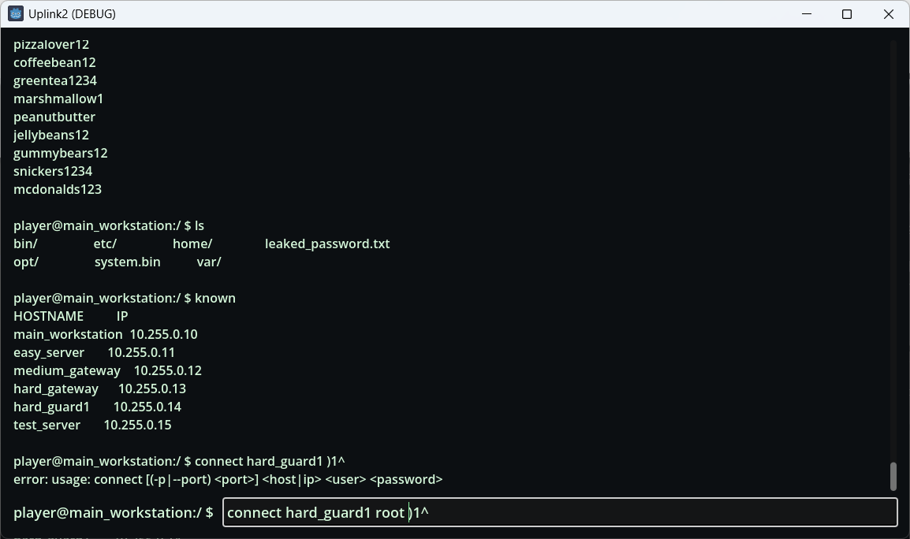

# Nexus Link

> **터미널 기반 코딩·해킹 시뮬레이션 게임 프로토타입** (Godot 4.6 .NET / Windows)

## 스크린샷

**터미널 프로토타입 (명령 실행 / known hosts / connect)**



**내장 에디터 + MiniScript (툴/스크립트 수정·자동화)**


---

## 한 문장 소개

플레이어는 가상 네트워크/서버/파일시스템에서 단서를 모으고, **MiniScript로 툴을 자동화·개조**하여 다양한 공략 루트를 설계합니다.

## API 문서

- https://mailtwo.github.io/nexus_link/

## 게임 콘셉트

- **Terminal-first UX**: 게임 초반은 리눅스풍 터미널에서 시작합니다. 게임이 진행될수록 워크스테이션의 기능이 점점 확장됩니다.
- **Toolchain 중심 플레이**: "정해진 명령을 누르는 사람"이 아니라, **툴을 만드는 사람**이 됩니다.
- **추론 기반 진행**: 관찰 → 가설 → 실험(툴 수정) → 결과 해석의 반복으로 난이도를 올립니다.

> 참고: 이 저장소의 README에는 스포일러/시나리오 리소스를 의도적으로 최소화했습니다.

## 안전한 가상화 원칙

이 프로젝트는 아래 원칙을 강제합니다.

- **실제 OS 접근 없음**: 로컬 디스크/프로세스/레지스트리 등 실세계 자원에 접근하지 않습니다.
- **실제 네트워크 접근 없음**: 소켓/HTTP/SSH 등 실세계 통신을 하지 않습니다.
- 모든 상호작용은 **가상 월드 시뮬레이터 + 샌드박스 API**로만 처리합니다.

## 핵심 설계 포인트 (요약)

### 1) 월드 런타임 모델
- 월드 상태는 `serverList(nodeId)` / `ipIndex` / `processList` 중심으로 구성됩니다.
- 시간은 렌더 FPS가 아니라 **고정 WorldTick(60Hz)** 누적으로 관리하여 결정성을 유지합니다.

### 2) VFS (가상 파일시스템)
- 구조: **Base + Overlay + Tombstone + BlobStore**
  - Base는 공용 "OS 이미지", Overlay는 서버별 변경분, Tombstone은 base 파일 삭제 마커.
- 200개+ 서버 노드 확장에도 비용이 폭발하지 않도록 "변경분만 저장"하는 오버레이 모델을 사용합니다.

### 3) 스크립팅 (MiniScript)
- 유저가 만드는 도구는 MiniScript 기반으로 작성/수정 가능.
- 라이브러리 스크립트는 `@name` 컨벤션으로 선언하며, `import`로 재사용합니다.
- 장기적으로 CPU/RAM 제약을 **업그레이드(성장) 시스템**으로 연결합니다.

### 4) 인게임 샌드박스 API
- MiniScript intrinsic 표면은 `term/time/fs/net/ssh/ftp` 중심으로 설계합니다.
- 모든 API는 **권한 검사 + 비용(cost) + 탐지(trace)** 규약을 따르는 것을 목표로 합니다.

### 5) 이벤트/미션 디스패치
- `privilegeAcquire` / `fileAcquire` 같은 사건을 이벤트로 처리하고,
  시나리오 핸들러(guard/action)로 미션 진행을 데이터 기반으로 확장합니다.

### 6) 멀티 윈도우 UX
- 영화처럼 여러 창이 동시에 떠 있는 경험을 목표로 합니다.
- NATIVE_OS / VIRTUAL_DESKTOP 두 모드를 지원합니다.
- NATIVE_OS 모드에서는 DesktopOverlay(배경 창)를 모니터 단위로 켜고 끌 수 있습니다.
- MVP에는 **SSH 로그인 창(서브 윈도우)** 계약이 포함됩니다.

## 현재 구현 범위 (프로토타입)

- Blueprint 로딩/파싱 파이프라인 (`src/blueprint`)
- World runtime 부트스트랩 + addressing + blueprint 적용 (`src/runtime/world`)
- VFS 기초 + overlay merge 규칙 (`src/vfs`)
- System call 코어(파서/레지스트리/디스패처) (`src/runtime/syscalls`)
- VFS syscall 모듈(phase 1): `pwd`, `ls`, `cd`, `cat`, `mkdir`, `rm`

## 저장소 구조

```text
src/
  blueprint/          # Blueprint schemas + YAML reader
  runtime/
    world/            # World runtime state/build/bootstrap/system-call entrypoint
    syscalls/         # System call core + modules
  vfs/                # Base virtual filesystem and path/merge logic
scenes/               # Godot scenes (main: TerminalScene.tscn)
scripts/              # GDScript/UI side scripts
plans/                # 기획/설계 문서 (SSOT)
  DOCS_INDEX.md       # 문서 라우팅 테이블 — 구현 전 반드시 먼저 읽을 것
  DECISIONS.md        # 설계 결정 이력 — 기존 결정 맥락 확인용
docs/
  screenshots/        # README 스크린샷
scenario_content/     # Runtime scenario resources and content data
```

## 기술 스택

- Godot 4.6 (.NET)
- C# / .NET 8
- YamlDotNet (blueprint 파싱)

## 빌드 & 실행

### 준비물

- Godot 4.6 .NET edition
- .NET SDK 8.x

### 빌드

```bash
dotnet build Uplink2.sln
```

### 실행

```bash
# 옵션 1) Godot Editor에서 project.godot 열고 실행
# 옵션 2) CLI
godot --path .
```

메인 씬: `res://scenes/TerminalScene.tscn`

## 문서 (SSOT: Source of Truth)

기획/규칙/데이터 스키마는 `plans/` 폴더의 문서가 단일 기준입니다.  
문서 간 라우팅 규칙은 **`plans/DOCS_INDEX.md`** 를 참고하세요.

| 문서 | 내용 |
|---|---|
| `00_overview.md` | 프로젝트 방향/철학/스코프 |
| `01_existing_hacking_games.md` | 장르 레퍼런스 분석 |
| `02_miniscript_interpreter_and_constraints.md` | MiniScript 실행/제약 |
| `03_game_api_modules.md` | 샌드박스 API 표면 + `@name` 컨벤션 |
| `04_attack_routes_and_missions.md` | 공격 루트/미션 템플릿 + 힌트 시스템 |
| `07_ui_terminal_prototype_godot.md` | 터미널/에디터 UX + CodeEdit 자동완성/툴팁 |
| `08_vfs_overlay_design_v0.md` | VFS 오버레이 아키텍처 |
| `09_server_node_runtime_schema_v0.md` | 월드 런타임 스키마 |
| `10_blueprint_schema_v0.md` | 블루프린트 스키마/월드 생성 규칙 |
| `11_event_handler_spec_v0_1.md` | 이벤트 시스템/가드 실행 규약 |
| `12_save_load_persistence_spec_v0_1.md` | 저장/로드 영속화 스펙 |
| `13_multi_window_engine_contract_v1.md` | 멀티 윈도우 + DesktopOverlay 엔진 계약 |
| `14_official_programs.md` | 공식 제공 프로그램 계약 (`scripts` 등) |
| `15_game_flow_design.md` | 게임 플로우/온보딩/플레이어 여정 설계 |

## 로드맵 (High Level)

- Syscall 도메인 확장: `run`, `connect`, 네트워크/프로세스/전송 영역
- MiniScript Runner 통합 + 리소스 제약(CPU/RAM) 연결
- 이벤트/플래그 기반 미션 진행(guard/action) 확장
- 멀티 윈도우 확장(DesktopOverlay, 트레이싱/토폴로지/전송 큐 등)
- `scripts` 공식 프로그램 + MiniScript `import` 라이브러리 시스템
